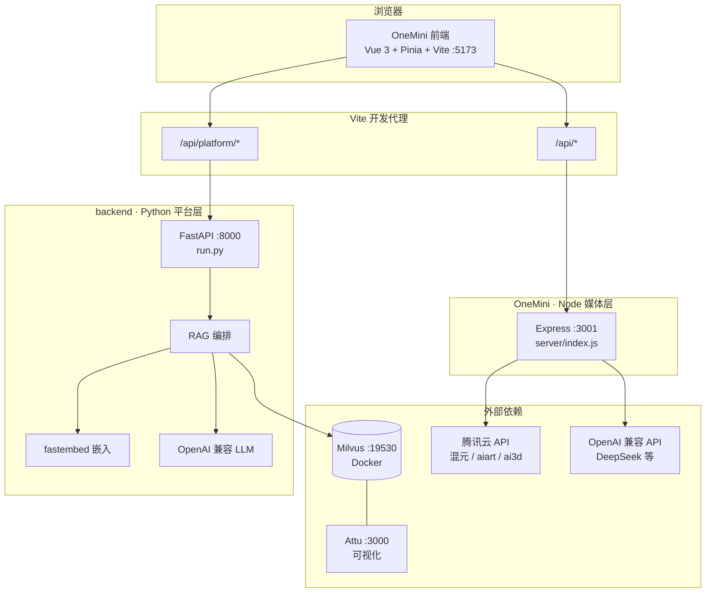

# 个人 AI 平台

面向多模态创作的本地 AI 工作台：**OneMini** 提供对话、图片/视频生成、3D 世界预览与模型配置；**Node 媒体代理** 对接腾讯云与 OpenAI 兼容接口；**Python 平台后端** 提供 Milvus 向量知识库与 RAG 增强问答。

---

## 系统架构总览



### 三层职责

| 层级 | 目录 | 技术栈 | 默认端口 | 职责 |
|------|------|--------|----------|------|
| **表现层** | `OneMini/` | Vue 3、TypeScript、Pinia、Three.js | 5173 | 侧栏导航、对话/创作/世界/模型/技能/知识库 UI；配置持久化（`localStorage`） |
| **媒体代理层** | `OneMini/server/` | Express、Node 20+ | 3001 | 流式对话、文生图、视频任务、混元 3D 提交/查询；统一签名调用腾讯云 |
| **平台服务层** | `backend/` | FastAPI、PyMilvus、fastembed | 8000 | 文档分块入库、向量检索、RAG 对话（含 SSE 流式） |

开发环境下，Vite 将两类 API 分流（见 `OneMini/vite.config.ts`）：

- `/api/platform/*` → `http://localhost:8000`（Python）
- `/api/*` → `http://localhost:3001`（Node）

生产部署时需用 Nginx 或网关做相同路径分流。

---

## 功能模块与页面

| 侧栏入口 | 视图组件 | 主要能力 | 后端路径 |
|----------|----------|----------|----------|
| 对话 | `ChatView` | 多轮聊天、附件（图/文档）、Mermaid、可选 **知识库 RAG** | Node `/api/chat/stream` 或 Python `/api/platform/chat/rag/stream` |
| 创作 | `CreateStudio` | Agent / 图片 / 视频模式、创作技能、生成偏好 | Node `/api/image`、`/api/video` |
| 世界 | `WorldStudio` | 文生/图生 3D 场景、Three.js 预览、任务轮询 | Node `/api/submit`、`/api/query`（腾讯云 ai3d） |
| 模型配置 | `ModelsView` | 手动添加模型、API Key、能力类型（chat/image/video/world） | 仅前端 `localStorage` |
| 技能配置 | `SkillsView` | 启用技能、绑定模型、System Prompt、多 Agent 骨架 | `agent-config/` + `localStorage` |
| 知识库 | `KnowledgeView` | 文本/文件入库、文档列表、删除（Milvus RAG） | Python `/api/platform/knowledge/*` |
| 知识图谱 | `WikiGraphView` | 上传 `raw/`、力导向图谱浏览、重建链接 | Python `/api/platform/wiki/*` |

### 对话路由逻辑（简要）

```
用户发送消息
    │
    ├─ 开启「知识库增强」且平台健康？
    │       └─ 是 → Python RAG 流式（检索 Milvus Top-K + LLM）
    │
    ├─ 触发多 Agent 关键词且已启用？
    │       └─ 是 → 前端编排多轮 Node 对话
    │
    └─ 否 → Node 流式对话（用户配置的模型 + System Prompt）
```

### RAG 知识库流程

```
录入（KnowledgeView）
  文本 / .txt / .md 上传
       ↓
  分块（chunk_size / overlap）
       ↓
  BGE-M3 本地嵌入（BAAI/bge-m3，1024 维 dense）
       ↓
  写入 Milvus 集合 onemini_knowledge_bgem3

问答（对话页勾选 RAG）
  用户问题 → 向量检索召回（RAG_RECALL_K，默认 20）
       ↓
  Qwen3-Reranker-0.6B 精排 → Top-K（RAG_TOP_K，默认 5）
       ↓
  拼接上下文 + 历史 → OpenAI 兼容 LLM 流式输出
```

### LLM-Wiki 结构化知识库（与 Milvus 分离）

仓库根目录 [`llm-wiki/`](llm-wiki/) 实现 [Karpathy LLM-Wiki](https://gist.github.com/karpathy/442a6bf555914893e9891c11519de94f) 范式：**原始资料 `raw/`** + **Agent 维护的 Markdown wiki** + **`WIKI.md` 模式说明**。通过 `[[wikilink]]` 与 `scripts/build_graph.py` 生成 `graph/links.json`，可用 Obsidian 图谱浏览。

- **不是**侧栏「知识库」的 Milvus 管道；请勿把 wiki 页面向量入库。
- `raw/` 当前为空，后续可放入 gist 等资料并由 Agent 执行 ingest。
- 详见 [`llm-wiki/README.md`](llm-wiki/README.md)。

### 创作与世界生成

- **创作页**：`createMode` 为 `agent` | `image` | `video`；图片走腾讯云 aiart（或演示占位）；视频为任务式接口（可扩展真实 API）。
- **世界页**：提交混元 3D 任务后轮询 `query`，结果在 `Viewport3D` 中预览。

---

## 目录结构

```
个人平台/
├── README.md                 # 本文件 · 整体架构
├── .gitignore
├── llm-wiki/                 # LLM-Wiki 结构化知识库（非 Milvus）
│   ├── raw/                  # 原始资料（只读）
│   ├── wiki/                 # LLM 维护的合成页
│   ├── graph/links.json      # wikilink 图谱导出
│   └── WIKI.md               # Agent 维护规范
│
├── OneMini/                  # 前端 + Node 代理
│   ├── src/
│   │   ├── components/       # 页面与 UI 组件
│   │   ├── stores/           # agent / settings / conversations / platform
│   │   ├── api/              # agent.ts（Node）、platform.ts（Python）
│   │   ├── config/           # 服务商、技能注册表、默认模型
│   │   └── services/         # 多 Agent 编排等
│   ├── server/
│   │   ├── index.js          # Express 路由与腾讯云签名
│   │   └── tencent-sign.js
│   ├── agent-config/         # AGENTS.md、SOUL.md、onemini.json 等骨架配置
│   ├── public/               # Logo、服务商图标
│   ├── vite.config.ts        # 开发代理
│   └── package.json          # npm run dev = Node + Vite 并行
│
└── backend/                  # Python 平台后端
    ├── app/
    │   ├── main.py           # FastAPI 入口、CORS、生命周期
    │   ├── config.py         # pydantic-settings · .env
    │   ├── routers/          # health / knowledge / chat
    │   └── services/         # milvus、embeddings、rag、llm、chunking
    ├── run.py                # uvicorn 启动（reload）
    ├── requirements.txt
    └── .env.example
```

---

## 技术栈

| 部分 | 选型 |
|------|------|
| 前端框架 | Vue 3 Composition API、Vue Router（视图由 Pinia `currentView` 切换） |
| 状态 | Pinia（对话历史、模型/技能、平台健康状态） |
| 样式 | SCSS、森林绿主题 CSS 变量 |
| 3D | Three.js |
| 图表/文档 | Mermaid、marked、DOMPurify |
| Node 代理 | Express 5、原生 `fetch`、腾讯云 TC3 签名 |
| Python 平台 | FastAPI、uvicorn、pymilvus、fastembed、httpx |
| 向量库 | Milvus Standalone（Docker） |

---

## 环境准备

### 1. Milvus + Attu（可选，知识库/RAG 需要）

```bash
# 确保 Docker 中 Milvus 映射 19530，Attu 映射 3000
# Milvus: localhost:19530
# Attu:   http://localhost:3000
```

未启动 Milvus 时，Python 服务仍可运行，日志会提示 `⚠ Milvus 未连接`，知识库与 RAG 不可用。

### 2. Python 平台后端（8000）

**方式 A：venv**

```bash
cd backend
python3 -m venv .venv
source .venv/bin/activate          # Windows: .venv\Scripts\activate
pip install -r requirements.txt
cp .env.example .env               # 编辑 OPENAI_API_KEY、Milvus 等
python run.py
```

**方式 B：Conda**

```bash
cd backend
conda create -n onemini-backend python=3.11 -y
conda activate onemini-backend
pip install -r requirements.txt
cp .env.example .env
python run.py
```

- API 文档：http://localhost:8000/docs  
- 健康检查：http://localhost:8000/api/platform/health  

详见 [backend/README.md](./backend/README.md)。

### 3. OneMini 前端 + Node API（5173 + 3001）

```bash
cd OneMini
cp .env.example .env               # TENCENT_SECRET_ID/KEY，可选 OPENAI_API_KEY
npm install
npm run dev                        # 同时启动 server/index.js 与 vite
```

- 前端：http://localhost:5173  
- Node API：http://localhost:3001/api/health  

详见 [OneMini/README.md](./OneMini/README.md)。

---

## 配置说明

### `backend/.env`

| 变量 | 说明 |
|------|------|
| `MILVUS_HOST` / `MILVUS_PORT` | Milvus 地址，默认 `127.0.0.1:19530` |
| `OPENAI_API_KEY` | RAG 回答用 LLM（必填才能生成） |
| `OPENAI_BASE_URL` | 兼容 DeepSeek、硅基流动等 |
| `CHAT_MODEL` | 如 `gpt-4o-mini` |
| `EMBEDDING_MODEL` | 默认 `BAAI/bge-m3`（约 2.3GB，FlagEmbedding）；切换后需重建 Milvus 集合并重新入库 |
| `RAG_RECALL_K` / `RAG_TOP_K` | 向量召回数 / 重排后送入 LLM 条数，默认 20 / 5 |
| `RAG_RERANK_ENABLED` | 是否启用 Qwen3 重排，默认 `true` |
| `RERANK_MODEL` | 默认 `Qwen/Qwen3-Reranker-0.6B`（ONNX，约 570MB） |

### `OneMini/.env`

| 变量 | 说明 |
|------|------|
| `TENCENT_SECRET_ID` / `TENCENT_SECRET_KEY` | 图片、3D 等腾讯云能力 |
| `TENCENT_REGION` | 默认 `ap-guangzhou` |
| `OPENAI_API_KEY` | Node 层默认对话 Key（可被模型配置覆盖） |
| `PORT` | Node 端口，默认 `3001` |

### 前端 `localStorage`

- **模型配置**：名称、model id、能力、Base URL、API Key  
- **技能配置**：启用状态、绑定模型、System Prompt  
- **对话历史**：会话列表与消息（本地存储）

---

## API 路由一览

### Node（`/api` → :3001）

| 方法 | 路径 | 说明 |
|------|------|------|
| POST | `/api/chat` | 非流式对话 |
| POST | `/api/chat/stream` | 流式对话 |
| POST | `/api/image` | 图片生成 |
| POST | `/api/video` | 视频生成（任务占位） |
| POST | `/api/submit` | 3D 世界任务提交 |
| POST | `/api/query` | 3D 任务查询 |
| POST | `/api/submit-rapid` | 快速 3D 提交 |
| POST | `/api/query-rapid` | 快速 3D 查询 |
| GET | `/api/models/catalog` | 模型展示目录（`?provider=&capability=`） |
| GET | `/api/health` | Node 服务健康 |

### Python（`/api/platform` → :8000）

| 方法 | 路径 | 说明 |
|------|------|------|
| GET | `/api/platform/health` | Milvus / 嵌入 / LLM 状态 |
| GET | `/api/platform/knowledge/documents` | 文档列表 |
| POST | `/api/platform/knowledge/documents` | 文本入库 |
| POST | `/api/platform/knowledge/documents/upload` | 文件上传 |
| DELETE | `/api/platform/knowledge/documents/{doc_id}` | 删除文档 |
| POST | `/api/platform/knowledge/search` | 语义检索 |
| POST | `/api/platform/chat/rag` | RAG 对话 |
| POST | `/api/platform/chat/rag/stream` | RAG 流式 |

---

## 典型联调流程

1. 启动 Milvus（Docker）  
2. 启动 `backend` → 确认 `/api/platform/health` 中 Milvus 为 ok  
3. 启动 `OneMini` → 打开 http://localhost:5173  
4. **知识库**：录入文档 → 等待嵌入完成  
5. **对话**：勾选知识库增强 → 提问验证 RAG  
6. **创作 / 世界**：在模型配置中填写对应能力模型的 Key  

```bash
# 终端 1
cd backend && conda activate onemini-backend && python run.py

# 终端 2
cd OneMini && npm run dev
```

---

## 子项目文档

- [OneMini/README.md](./OneMini/README.md) — 前端功能、模型/技能配置、Node API  
- [backend/README.md](./backend/README.md) — Milvus、RAG、Python API 细节  

---

## 许可证

OneMini 子项目采用 MIT，见 [OneMini/LICENSE](./OneMini/LICENSE)。
